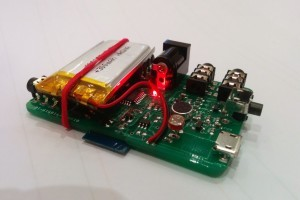

<title>Rory Cripin</title>

# Rory Crispin

 

Graduate Computer Science student at the University of Nottingham with an
interest in Functional Programming, Embedded Systems and Network Technologies.
Presently working in the Cloud R&D team @ [Starleaf](https://starleaf.com).

**Email**: rorycr \\~/ icloud.com

**Linkedin CV**: [https://www.linkedin.com/in/rory-crispin/](https://www.linkedin.com/in/rory-crispin/)

**Github** <https://github.com/RoryCrispin>

---

I spend my time thinking about the design of elegant systems and have strong
opinions about privacy in the digital age.

I\'ve worked with [StarLeaf](https://www.starleaf.com/), [Atos](https://atos.net/en/), [Deliveroo](https://deliveroo.co.uk/), as a Python & Arduino tutor and on a
number of cool personal projects;

# Peer to Peer Poker Dissertation

Abstract: In this project, we explore the concept of playing Texas Hold \'em
Poker without a trusted authority by using a decentralised Peer to Peer network
model. We consider the applications of such a protocol in fighting internet
censorship while avoiding funding corrupt casinos, and the resultant challenges
involving the cryptographic protocol, the lack of trust in such a decentralised
system and in the implementation of poker. The final product is a toolkit for
peer to peer card games, with an implementation of Texas Hold \'em poker to
demonstrate it’s functionality.
[PDF link](./psyrc3-g53ids-no-appendix.pdf)

# LightBox

 

# toroCam

ToroCam is a camera control system, which gives you unparallelled control over
your SLR though an open source app and a small, Arduino compatible board. Unlike
competing solutions, your phone is never tethered to the camera when using
toroCam as a high performance dedicated board connects to the camera directly
and the phone is only responsible for sending instructions on which triggers the
board should use - allowing the system to react in microseconds to sensor
values, far quicker than any dedicated mobile based solution which allows us to
take precisely timed photos such as the following:

 

The custom made toroCam boards look like this:

 

<https://github.com/RoryCrispin/toroCamAndroid>

# Choco Quickstart

Choco Quickstart is a nifty little tool that I wrote to give windows users a
quick quickstart package of software for new installs using the Chocolatey
package manager. 

Unlike the competition, choco quickstart makes use of a package manager; so
updates to software are easy to manage. (Instead of just bundling all the installers into one runnable.)

<https://github.com/RoryCrispin/Chocolatey-Quickstart>

# Chive music player

Chive is a web based music streaming website that pulls data about Albums,
Artists, Genres and related music from the Last.fm and MusicBrainz APIs,
presenting a music-first frontend that looks up the relevant youtube videos for
each song which is played in the background. 

<https://github.com/RoryCrispin/chive>

